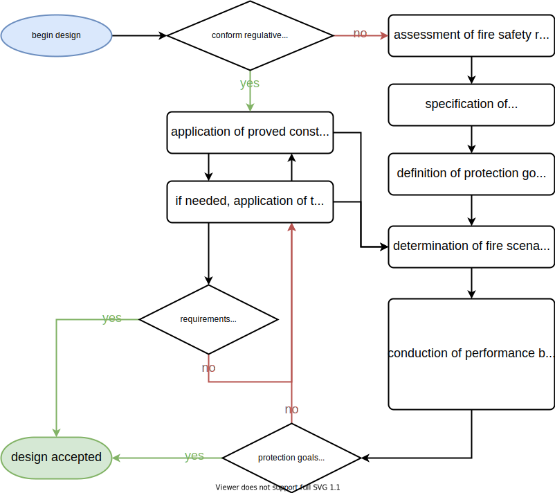

# Fire Safety Engineering

Modelling of fires is one aspect in the broad spectrum of fire safety engineering (FSE). While the engineering topics aim for the practical application, fire models are used for research questions in fire safety science (FSS).

The following sections give only a very brief introduction to the broad topics adressed here. Starting points for further reading in this field are give in {cite}`vfdb-leitfaden:2020`, {cite}`VDI-6019-1`, {cite}`VDI-6019-2` or ,e.g., chapters 37, 38, and 39 of {cite}`sfpe-handbook-5th`.

## Fire Safety Legislation

The [German constitutional law (Grundgesetz)](https://en.wikipedia.org/wiki/Basic_Law_for_the_Federal_Republic_of_Germany) states that

* every person shall have the right to life and the right for physical integrity, and
* property entails obligations.

Based on this fundamental law, four protection goals, w.r.t. fire safety, are formulated in the  [Pattern Building Code (Musterbauordnung)](https://www.bauministerkonferenz.de/Dokumente/42323097.pdf). This code is specified for each federal state in Germany as the state-individual Building Code (Bauordnung). 

The protection goals are:
1. prevent the outbreak of a fire
1. prevent the propagation of heat and smoke
1. enable escape and rescue measures
1. enable effective firefighting measures

They are meant to be applied to the whole lifecycle of a building, i.e. during construction, service, modification and maintenance.

## Prescriptive Designs

In a prescriptive design, fire safety measures are carried out based on general rules. This leads to benefits like 

* regulations and standards enable *deemed-to-satisfy* solutions
* mostly practicable and economic
* fire safety design can be conducted by *semi-qualified* persons
* legal certainity

However, this design approach has also some flows, like

* descriptive designs are prone for individuality and complexity
* the application of *deemed-to-satisfy* strategies can be inappropriate, uneconomic or even impossible
* under certain circumstances nonconformities to applicable regulations and standards are unavoidable
* restrictions for international harmonisation and standardisation

An alternative to prescriptive designs is the application of performance based designs.

## Performance Based Designs

**General Approach**

In contrast to the static and general rules of a regulation, the performance based design follows the idea to create an equivalent level of safety by satisfying protection goals. This process allows the engineers to use multiple approaches, which do also include fire simulations, to iteratively design a safety concept. A schematic flow diagram is shown in {numref}`fig-performance-based-design`.

:::{figure-md} fig-performance-based-design



Simplified flow diagram of a prescriptive and performance based design.  
:::

**Qualitative Analysis**

The protection goals have to be defined to fulfill in a wide range of conceivable scenarios. These definitions must consider:
* various structures
* different and variable uses
* occupants physics and behaviour

The scope of a qualitative analysis covers the following aspects:
* building concept
  * fundamental construction
  * building materials
  * fire and smoke sectioning
  * topology and separation of the escape routes
* concept of use 
  * fire loads
  * occupants
  * usage scenarios
* infrastructure 
  * technical systems
  * defensive fire protection measures
* fire scenarios
  * fire locations
  * possibilities for flame and smoke propagation
  
  
**Quantitative Analysis**

For a quantitatve analysis, models or empirical data is used for the evaluation of:
* fire scenarios and design fires
* fire effects, smoke propagation and exhausting
* building components and bearing structure
* assessment of technical and defensive measures
* life safety during fire exposure
* egress in case of emergency

## Fire Scenario

In order to evaluate an individual fire incident, an explicit fire scenario must be defined. In general it needs to consider:

* the location of the seat of fire
* the fire load 
* the fire development
* the ventilation conditions
* the impact of technical measures
* the influence of firefighting measures

In a fire scenario, the fire development – especially the rate at which it releases heat – must be specified. A common approach is to define a time-dependent heat release rate, $\mf HRR(t)$, which is based on a so called natural fire. A natural fire curve is an empirical approximation to real compartment fires, see {numref}`fig-natural-design-fire`, which can be represented in three phases:

1. **Growth**: After ignition, the fire increases the rate at which it releases heat until it reaches the flashover. In this phase the heat release rate follows a quadratic function, i.e.
  
    $$\mf HRR(t) = \alpha\cdot t^2\quad,$$
    where $\mf \alpha$ is the fire intensity coefficient.
1. **Fully developed**: After the flashover all material that is capable to burn is participating in the fire. During this phase the heat release rate reaches its maximal value $\mf HRR_{max}$ and stays constant, i.e. 
  
    $$\mf HRR(t) = HRR_{max}\quad.$$
1. **Decay**: When about 70% of the fire load is consumed, the decay phase starts. During that phase the heat release rate linearly decays and reaches a value of zero at time $\mf t_{end}$, i.e. 
  
    $$\mf \frac{HRR(t)}{dt} = const \quad.$$
    
    
:::{figure-md} fig-natural-design-fire


Heat release rate curve based on the natural fire approximation.
:::

Following tables presents selected values for the fire load and fire intensity coefficient, see {cite}`VDI-6019-1`. 


```{list-table} Fire intensity coefficients
:header-rows: 1
:name: tab-alpha
:widths: auto
:align: right

* - Fire development rate 
   - Fire intensity coefficient, <br>$\mf \alpha \ / \ kW/s^2$
* - slow
   - 0.0029
* - medium
   - 0.012
* - fast   
   - 0.047
* - very fast
   - 0.188
```


```{list-table} Specific maximal heat release rates
:header-rows: 1
:name: tab-hrr-max
:widths: auto
:align: right

* - Building or object 
   - Specific maximum heat release rate, <br> $\mf HRR_{max}'' \ / \ kW/m^2$
   - Fire development rate
* - offices
   - 300
   - medium
* - hotel rooms
   - 250
   - medium
* - sales areas
   - 500
   - fast
* - exhibitions, theatres, cinemas, stages
   - 500
   - fast
* - residence
   - 500
   - medium
* - museum
   - 300
   - slow
* - burning semi-trailer
   - 400
   - fast
* - wooden pallets <br> size: $\mf 1.2~m \times 1.2~m \times 0.14~m$,<br> humidity: 6% to 12%, <br> stacked / block storage, <br> height: $\mf 0.5~m$
   - 1250
   - medium up to fast
* - postbags, storage height $\mf 1.5~m$
   - 400
   - fast
```
