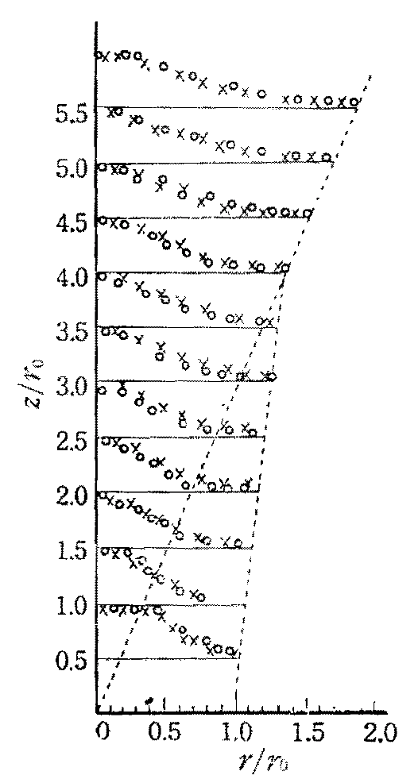

# Modelling Approaches

## Overview

Fire safety science (FSS) and fire safety engineering (FSE) is not limited to describe fires and their impact on building structures, yet other topics, like evacuation or risk analysis, are not part of this lecture. The understanding and description of fires allow for technical and organisational (active and preventive) measures to limit or even prevent damage. In general, these descriptions lead to the development of mathematical models, which are validated using physical and chemical experiments. From the practical point of view, these models are applied to design and evaluate safety concepts. 

The development of analytical and numerical models aims to describe processes and / or the impacts related to fires. This is true for compartment as well as wildland fires and covers many aspects, like the height of the hot gas layer, the speed and direction at which flames propagate, the toxicity of smoke or the activation and effectivenes of technical measures. 

Models range from empirical data models to models based on first principles. Yet, mostly experiments are needed to adjust unknown model parameters and to validate the predictive capabilities of a model.

A brief and by far not complete or accurate overview of the historical time scales of scientific development, which modern day approaches are based on, is given in the following table.


```{list-table} Brief historic overview of scientific development
:header-rows: 1
:name: tab-history-overview
:widths: auto
:align: right

* - Time 
   - Event
   - Key Initiator
   
* - ∼1650
   - conservation of momentum
   - Newton

* - 1737 
   - relationship pressure and velocity in a fluid
   - Bernoulli
   
* - ∼1750
   - conservation of energy
   - Clausius
   
* - 1807
   - heat conduction equation
   - Fourier
   
* - 1827 / 1845
   - viscous equations of fluid motion
   - Navier & Stokes
   
* - 1855
   - mass diffusion equation
   - Fick
   
* - 1884
   - temperature dependent chemical reaction rate
   - Arrhenius
* - ~1900
   - thermal radiation
   - Planck
   
* - 1928
   - solution of diffusion flame in a duct
   - Burke & Schumann
   
* - ∼1930
   - combustion equations with kinetics
   - Semenov
   
* - ∼1950
   - convective burning solutions
   - Emmons & Spalding
   
* - ∼1960
   - diverse fire phenomena solutions
   - Thomas
```

## Experiments

Models have little to no value if they are not supported by experiments. Thus the design and conduction of experiments on various scales is the fundament of fire safety science and engineering. Some experimental aspects in the context of experiments are: 
* material flamability tests
* measurement of quantities like heat release, structural temperatures, heat radiation, toxic gas concentrations, etc.
* bench-scale experiments for material or building element evaluation, potentially with a separation of effects
* real-scale experiments aim for the full integration of all interactions in a fire

:::{figure-md} fig-exp-cone-calorimeter


Example for a bench-scale experiment: a cone calorimeter. The sample size is about $\sf\small 10~cm \times 10~cm$.
:::

:::{figure-md} fig-exp-orpheus


Example for a real-scale experiment: hot gas experiments within a metro station. These experiments were conducted by I.F.I. Aachen, Germany, within the [ORPHEUS](http://www.orpheus-projekt.de) project.
:::

Experiments differ from tests. While a test checks for a property or a result, there is no explicit aim to gain scientific insight from it. In an experiment the outcome is designed with an open question and aims to extend the knowledge base with new findigs. 

## Analytical Models

The first kind of models are analytical models. They are either based on empirical data and are thus just their mathematical representation. Or, they are based on fundamental approximations and symmetries, which lead to a closed analytical solution. 

Despite their, sometimes very limitting, approximations, they offer a tool to quickly estimate the quantities of interest. In addition, they can be directly integrated into other, potentially more complex, models. Another important aspect is, that analytical models can be checked by a reader, as it is in general possible to write down all needed input parameters. 

Of course, due to the underlying simplifications and assumptions, their applicability is limited.

**Example – Plume Temperature**

The measurement of the local gas temperature in a plume leads to an empirical description for the time averaged values. Based on measurements like in {numref}`fig-exp-plume-profile`, a mathematical formulation can be derived to describe the observations. 

:::{figure-md} fig-exp-plume-profile



Example for experimentally captured normalised temperature profiles of a plume. Source: {cite}`Yokoi.1960`.
:::

The temperature rise $\mf \Delta T$ in a turbulent plume may be generally approximated by:

$$
\mf \Delta T(z, r) = T_m(z) \cdot\exp\left(-\beta\left(\frac{r}{b(z)}\right)^2\right)
$$ (eq-deltaT-plume)

where
* $\mf z,r$: height above plume source and distance from centerline
* $\mf b(z)$: plume radius
* $\mf \beta$: empirical constant ≈ 1
* $\mf T_m(z)$: centerline temperature (at z)

**Example – Mass Flow**

With analytical descriptions of plumes and other phenomena, it becomes possible to investigate the impact and fire protection measures in compartment fires. An example for this is the estimation of the plume mass flow $\mf \dm_{pl}$ from a fire with a given heat release $\mf \dQ$. This way it becomes possible, e.g., to pose requirements for a smoke extraction system.

```{margin} Derivates
In this script the following short forms for derivatives are used:

* time derivative:

$$\mf \dot{\phi} = \frac{d\phi}{dt}$$

* spatial derivatives:

$$\mf \phi' = \frac{d\phi}{dl}$$

$$\mf \phi'' = \frac{d\phi}{dA}$$

$$\mf \phi''' = \frac{d\phi}{dV}$$
```

:::{figure-md} fig-exp-analytical-mass-flow


Illustration of the quantities involved in the analytical estimation of the plume mass flow $\mf \dm_{pl}$.
:::

Following, e.g. {cite}`VDI-6019-2`, the plume mass flow $\mf \dm_{pl}$ can be directly computed, whereas two regimes need to be considered separately. These are distinguished by the ratio of the distance of the fire to the smoke layer $\mf z_{eff}$ and the square root of the fire area $\mf A_{fire}$, i.e. $\sf \sqrt{A_{fire}}$. 

**Jet formation regime**

In the case of 

$$ 
\mf \frac{z_{eff}}{\sqrt{A_{fire}}} \le 2 \quad ,
$$ (eq-zA-ratio)

the mass flow can be computed as

$$
\mf \dm_{pl} = C_1 \cdot z^{1.5}_{eff}\cdot \sqrt{4\pi A_{fire}}\quad .
$$ (eq-dmpl-jet)

The free parameter, here the induction coefficient $\mf C_1$, takes a value of $\mf 0.19~kg\,m^{-5/2}\,s^{–1}$.

The solution in equation {eq}`eq-dmpl-jet` only depends on geometrical values, the heat release rate has no impact here. The solution is simple, yet there are a assumptions, which have to be satisfied. A few of them are:    

* the considered compartment is a single storey smoke reservoir
* the minimum compartment height is $\mf 4.0~m$
* the room temperature is lower than the smoke gas temperature
* it is only valid for fires with a power of $\mf 8~kW$ to $\mf 30~kW$ with a specific heat release rate per area of $\mf 200~kW/m^2$ to $\mf 1800~kW/m^2$
* the fire source diameter $\mf d_{fire}$ is between $\mf 0.4~m$ and $\mf 9~m$

**Similarity regime**

If the equation {eq}`eq-zA-ratio` is not valid, the plume is in the so called similarity regime. Here the plume can be handled as an undisturbed plume, as the distance to smoke layer is large compared to the initial width of the plume. In this case there are multiple possible approaches to describe the plume. One of them is based on the Heskestad plume model and predicts the plume mass flow as

$$
\mf \dm_{pl} = C_2\cdot \dQ_{conv}\cdot \left( z_{eff} - z_0 \right)^{5/3} \quad .
$$ (eq-dmpl-similarity)

The additional quantities needed for the evaluation are:

* The convective part of the heat release rate $\mf \dQ_{conv}$, which can be estimated as 70% of the total heat release rate, i.e. 

  $$
  \mf \dQ_{conv} = 0.7 \dQ \quad.
  $$

* A virtual origin of the plume, which is located at a distance $\mf z_0$. There exist various ways to compute it, yet one of them is given by

  $$
  \mf z_0 = -1.02 d_{fire} + 0.083 \dQ^{0.4} \quad,
  $$
  where the diameter of the fire is denoted as $\mf d_{fire}$.

* The value of the induction coefficient $\mf C_2$ is about $\mf 0.071~kg \left(kW\,s^3\,m^5\right)^{-1/3}$.

This model leads to valid predictions, if the following conditions are met:

* the fire area is compact, i.e. of a shape that can be represented as a circle or  a square,
* the ambient temperature of the plume is constant, and
* the environment is not disturbing the plume. 

## Single Compartment Fire

For illustrating the following models, a canonical compartment fire setup is used, see {numref}`fig-compartment-flow-basic`. It consists of a single compartment with a localised fire. The only opening to the ambient is a door.

:::{figure-md} fig-compartment-flow-basic


Flows and regimes in a canonical compartment fire with a single opening, here a door.
:::

In a very simplified representation, the following phenomena can be observed:

* A smoke layer builds up below the ceiling of the compartment, which creates a stratification. The hot combustion products and the entreined air are transported from the fire to the smoke layer due to buoyancy -- this is the plume.
* The hot smoke layer grows downwards until it reaches the top of the door opening and hot gas can leave the compartment and forms a spill plume.
* At the door opening, hot gas leaves the compartment in the top region of the opening, while fresh cold air enters the compartment in the lower region.

## Zone Models

The above figure {numref}`fig-compartment-flow-basic` indicates that the domain of interest can be separated into two zones: an upper and a lower layer, see {numref}`fig-two-zone-model`. Zone models use this separation to simplify the overall scenario and predict the physical (e.g. temperature) and geometrical (e.g. height) properties of the zones.

:::{figure-md} fig-two-zone-model


Illustration of a simple two zone – the upper hot and the lower cold gas layer – model.
:::

```{margin} Note:
The according fundamental thermodynamical relations will be introduced in following section of the lecture. This section is just meant to demonstrate the general approach of zone models.
```

In the following, the [Consolidated Fire And Smoke Transport (CFAST)](https://pages.nist.gov/cfast/index.html) model {cite}`CFAST7-TR.2021` is used to demonstrate the approach of zone models. Here, the physical quantities like temperature $\mf T_i$, volume $\mf V_i$, and pressure $\mf p$ for each layer, i.e. $\mf i\in [u,l]$, are computed. These are single values, which represent the whole zone. 

Using the ideal gas law, equation {eq}`eq-zone-model-ideal-gas-law`, the mass $\mf m_i$ of a layer can be computed. 

$$
\mf pV_i = m_i R T_i
$$ (eq-zone-model-ideal-gas-law)

Where $\mf R$ is the specific gas constant, here with a value of approximately $\mf 290~J\,kg^{-1}\,K^{-1}$ for air. The change of internal energy of a zone is described by the sum of all heat sources $\mf \dq_i$ and the work done by the change of the layer's volume, i.e. $\mf p\cdot dV_i/dt$:

$$
\mf \frac{d}{dt}\left( c_v m_i T_i\right) = \dq_i - p\frac{dV_i}{dt}\quad,
$$ (eq-zone-model-internal-energy)

with the specific heat capacity at constant volume $\mf c_v$. 

Besides the handling of boundary conditions and other additional processes, a set of coupled ordinary differential equations is derived to prescribe the evolution of the pressure 

$$
\mf \frac{dp}{dt} = \frac{\gamma - 1}{V} (\dq_l + \dq_u)\quad, and
$$ (eq-zone-mode-pressure)

the upper volume 

$$
\mf \frac{dV_u}{dt} = \frac{1}{p\gamma}\left((\gamma-1)\dq_u - V_u \frac{dp}{dt}  \right)\quad ,
$$ (eq-zone-mode-vu)

where the lower volume $\mf V_l$ can be computed with the given total volumen of the compartment $\mf V$ as $\mf V_l = V - V_u$. The temperature development in each layer is given by 

$$
\mf \frac{dT_u}{dt} = \frac{1}{c_p m_u}\left( \dq_u - c_p \dm_u T_u + V_u \frac{dp}{dt}\right)\quad, and
$$ (eq-zone-mode-Tu)

$$
\mf \frac{dT_l}{dt} = \frac{1}{c_p m_l}\left( \dq_l - c_p \dm_l T_l + V_l \frac{dp}{dt}\right)\quad .
$$ (eq-zone-mode-Tl)

This set of equations can be numericaly solved and leads to a time-dependent solution for the four stated quantities.

## Field Models

While zone models decompose the domain of interest into few regions, field models discretise the volume with a three-dimensional mesh, see {numref}`fig-field-model`. This discretisation is needed to numerically solve a set of partial differential equations for quantities like density, velocity, pressure and enthalpy in each node of the mesh. 

:::{figure-md} fig-field-model


Illustration of the domain discretisation in a field model.
:::

The solid objects in the domain have to be represented in the mesh and at these positions, boundary conditions need to be evaluated. As a result of the according numerical solution procedure, spatially and temporaly resolved values for the above mentioned quantities are computed. See {numref}`fig-field-model-temperatures` for an illustrative representation of a temperature field at one point in time.

:::{figure-md} fig-field-model-temperatures


Illustration of the temperature values in each element (cell) of the domain discretisation.
:::

The main content of this lecture are the numerical models and solution approaches applied in field models. This methodology is in general called computational fluid dynamics (CFD), where fire simulations are a specialised topic within a very broad range of applications. The simulation model described in this lecture is the [Fire Dynamics Simulator (FDS)](https://pages.nist.gov/fds-smv/index.html). 
