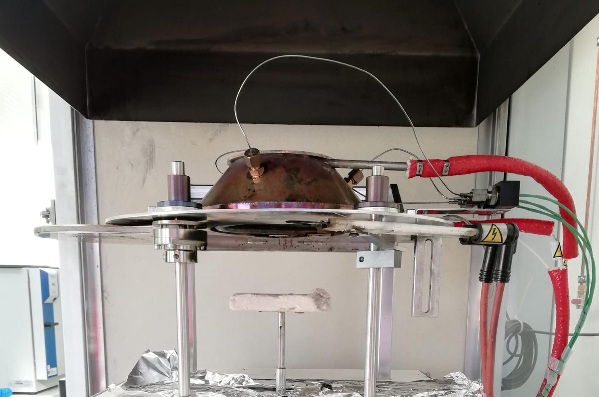

# Modelling Approaches

Fire safety science (FSS) and fire safety engineering (FSE) is not limited to describe fires and their impact on building structures, yet other topics, like evacuation or risk analysis, are not part of this lecture. The understanding and description of fires allows for technical and organisational (active and preventive) measures to limit or even prevent damage. In general, these descriptions lead to the development of mathematical models, which are validated using physical and chemical experiments. From the practical point of view, these models are applied to design and evaluate safety concepts. 

The development of analytical and numerical models aims to describe processes and / or the impacts related to fires. This is true for compartment as well as wildland fires and covers may aspects, like the height of the hot gas layer, the speed and direction at which flames propagate, the toxicity of smoke or the activation and effectivenes of technical measures. 

Models range from empirical data models to models based on first principles. Yet, mostly experiments are needed to adjust unknown model parameters and to validate the predictive capabilities of a model.

A brief and by far not complete or accurate overview of the historical time scales of scientific development, which modern day approaches are based on, is give in the following table.


```{list-table} Brief historic overview of scientific development
:header-rows: 1
:name: tab-history-overview
:widths: auto
:align: right

* - Time 
   - Event
   - Key Initiator
   
* - ∼1650
   - conservation of momentum
   - Newton

* - 1737 
   - relationship pressure and velocity in a fluid
   - Bernoulli
   
* - ∼1750
   - conservation of energy
   - Clausius
   
* - 1807
   - heat conduction equation
   - Fourier
   
* - 1827 / 1845
   - viscous equations of fluid motion
   - Navier & Stokes
   
* - 1855
   - mass diffusion equation
   - Fick
   
* - 1884
   - temperature dependent chemical reaction rate
   - Arrhenius
* - ~1900
   - thermal radiation
   - Planck
   
* - 1928
   - solution of diffusion flame in a duct
   - Burke & Schumann
   
* - ∼1930
   - combustion equations with kinetics
   - Semenov
   
* - ∼1950
   - convective burning solutions
   - Emmons & Spalding
   
* - ∼1960
   - diverse fire phenomena solutions
   - Thomas
```

## Experiments

Models little to no value if they are not supported by experiments. Thus the design and conduction of experiments on various scales is the fundament of fire safety science and engineering. Some experimental aspects in the context of experiments are: 
* material flamability tests
* measurement of quantities like heat release, structural temperatures, heat radiation, toxic gas concentrations, etc.
* bench-scale experiments for material or building element evaluation, potentially with a separation of effects
* real-scale experiments aim for the full integration of all interactions in a fire

:::{figure-md} fig-exp-cone-calorimeter



Example for a bench-scale experimente: a cone calorimeter. The sample size is about $\sf\small 10~cm \times 10~cm$.
:::

:::{figure-md} fig-exp-orpheus


Example for a real-scale experimente: hot gas experiments within a metro station. These experiments were conducted by I.F.I. Aachen, Germany, within the [ORPHEUS](http://www.orpheus-projekt.de) project.
:::

Experiments differ from test. While a test checks for a property or a result, there is no explicit aim to gain scientific insight from it. In an experiment the outcome is designed with an open question and aims to extend the knowledge base with new findigs. 

## Analytical Models

The first level of models are analytical models. They are either based on empirical data and are thus just their mathematical representation. Or, they are based on fundamental approximations and symmetries, which lead to an closed analytical solution. 

Despite their, sometimes very limitting, approximations, they offer a tool to quickly estimate the quantites of interest. In addition, they can be directly integrated into other, potentially more complex, models. Another important aspect is, that analytical models can be checked by a reader, as it is in general possible to write down all needed input parameters. 

Of course, due to the underlying simplifications and assumptions, their applicability is limited.


## Zone Models

## Field Models