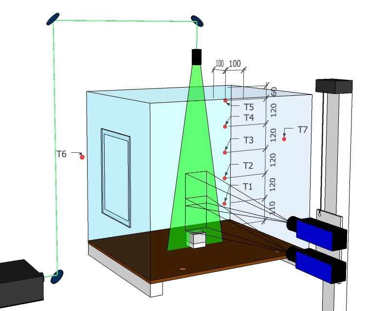
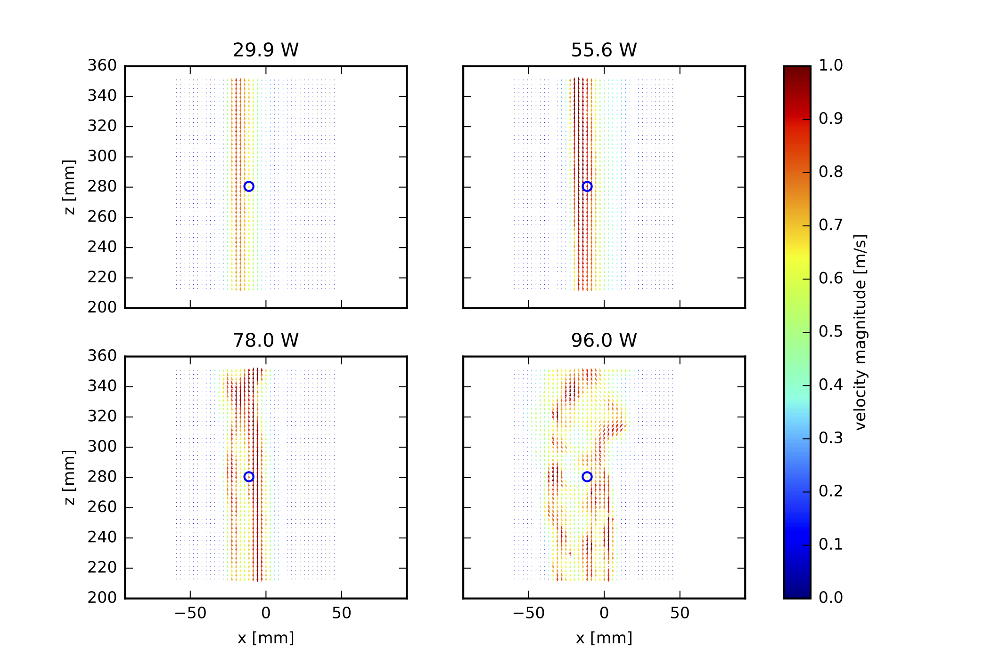
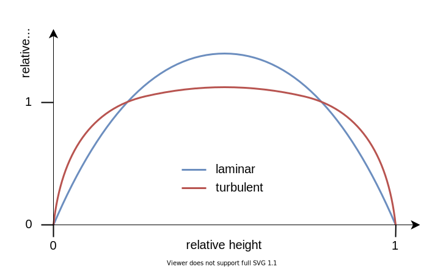
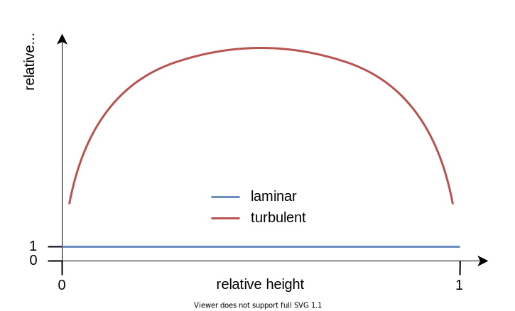

# Turbulence

Turbulence is one of the major scientific challenges. The mathematical description and experimental data related to fluid dynamics are known and available for over one hundred years.

>“Turbulence is the most important unsolved problem of classical physics.”<br>
— Richard Feynman

>”When I meet God, I am going to ask him two questions: Why relativity, and why turbulence?
I really believe he will have an answer for the first.”<br>
— Werner Heisenberg

Understanding the nature of turbulence is one of the [Millennium Problems](https://www.claymath.org/millennium-problems/navier–stokes-equation).

:::{figure-md} fig-turbulence-great-wave


Great wave off Kanagawa. Source: [Wikimedia Commons](https://commons.wikimedia.org/wiki/File:Great_Wave_off_Kanagawa2.jpg).
:::


:::{figure-md} fig-turbulence-kh-waves


[Kelvin–Helmholtz instability](https://en.wikipedia.org/wiki/Kelvin–Helmholtz_instability) in a cloud formation. Source: [Wikimedia Commons](https://commons.wikimedia.org/wiki/File:Kelvin-Helmholtz_waves.jpg).
:::

On of the reference books for turbulence is {cite}`Pope:2000` and further interesting LES reading: {cite}`Pope:2004`.

## Characterisation

Among the first scientific experiments to characterise and analyse turbulent flows, is the work of [Osborne Reynolds](https://en.wikipedia.org/wiki/Osborne_Reynolds). He studied the conditions under which a flow undergoes the transition from a ordered to a chaotic state. One of these studies is published in {cite}`Reynolds:1883`, see {numref}`fig-turbulence-reynolds-experiment` and {numref}`fig-turbulence-reynolds-results`.

:::{figure-md} fig-turbulence-reynolds-experiment


Reynolds' experiment in 1883. Source: [Wikimedia Commons](https://commons.wikimedia.org/wiki/File:Reynolds_fluid_turbulence_experiment_1883.jpg).
:::

:::{figure-md} fig-turbulence-reynolds-results


Observations of the flow in Reynolds' experiment, see also original article {cite}`Reynolds:1883`. Source: [Wikimedia Commons](https://commons.wikimedia.org/wiki/File:Reynolds_observations_turbulence_1883.svg).
:::

With these experiments the flow transition as a function of the Reynolds number can be investigated. An other example for the determination of the transition from a laminar to a turbulent state for a bouyant plume is shown in {numref}`fig-turbulence-plume-setup`. The full experimental setup and results are given in {cite}`Meunders:2018`.

:::{figure-md} fig-turbulence-plume-setup


Experimental setup of a buoyant plume, see {cite}`Meunders:2018` for more details. Here, the heating power of the copper block determines the flow velocity.
:::

:::{figure-md} fig-turbulence-plume-quiver


Example of instanteneous velocity fields for different heating rates. The velocity field is captured with a [particle imaging velocimetry (PIV)](https://en.wikipedia.org/wiki/Particle_image_velocimetry) technique.
:::

:::{figure-md} fig-turbulence-plume-time-series


Time series of velocity components at selected locations (blue circles in {numref}`fig-turbulence-plume-quiver`).
:::

:::{figure-md} fig-turbulence-plume-fluctuations


Statistics of velocity fluctuations.
:::

The canonical setup for the transition form a laminar to a turbulent flow is a pipe flow, as shown in {numref}`fig-turbulence-pipe-setup`. Starting with a uniform flow at the inlet, the flow at the boudaries is deaccelerated and an acccording flow pattern develops. Depending on the Reynolds number, the mean velocity profiles differ significantly. While in the laminar case a parabolic profile develops, a flattened profile is characteristic for a turbulent flow, see {numref}`fig-turbulence-pipe-velocity`. An other observation is that the effective viscosity differs in both cases. While in the laminar case the observed value is the material property and thus constant, it shows a higher and dynamic value in the turbulent case, see {numref}`fig-turbulence-pipe-viscosity`. 

:::{figure-md} fig-turbulence-pipe-setup


Schematics of a pipe flow. The arrows indicate the time averaged velocity.
:::

:::{figure-md} fig-turbulence-pipe-velocity


Schematics mean flow in a pipe.
:::

:::{figure-md} fig-turbulence-pipe-viscosity


Schematics of the effective viscosity in a pipe flow.
:::

The following video shows a few simple experiments, including the one performed by Reynolds, that might help to understand some of the fundamental concepts of fluid flow and turbulence.

<iframe width="60%" src="https://www.youtube-nocookie.com/embed/LTHIGdIEKJI" title="YouTube video player" frameborder="0" allow="accelerometer; clipboard-write; encrypted-media; gyroscope; picture-in-picture" allowfullscreen></iframe><br>


## Scales

Turbulence is dominated by the interaction of large and small scales, which are very different:
* production of kinetic energy, e.g. a fire at a scale of $\mf 1~m$
* dissipation of kinetic energy into heat, in air with a velocity of $\mf 1~m/s$ the dissipation scale ([Kolmogorov scale](https://en.wikipedia.org/wiki/Kolmogorov_microscales)) is about $\mf 25~\mu m$

:::{figure-md} fig-turbulence-energy-cascade


Scales involved in a turbulent flow.
:::

The integral scale, at which the flow structures break into smaller structures, connects both above scales. 

In turbulence literature the structures are often represented by wavenumbers $\mf k$:

$$
\mf k = \frac{2\pi}{L}\quad .
$$

Thus, the smallest resolvable eddy $\mf L=2\Delta x$ has a wavenumber of 

$$
\mf k_0 = \frac{\pi}{\Delta x}\quad .
$$

:::{figure-md} fig-turbulence-subgridscale


Scales and resolution on a numerical grid.
:::

Often, the kinetic energy spectrum is considered in turbulence. It can be divided into (at least) three sections, as outlined in {numref}`fig-turbulence-energy-spectrum-physical`. 


:::{figure-md} fig-turbulence-energy-spectrum-physical


Energy spectrum for a homogeneous isotropic turbulent flow.
:::

Given a finite value of the grid resolution, thus also the minimal wavenumber, the energy spectrum can not be fully resolved and the unresolved parts must be modelled with a sub-grid scale (SGS) model.

To model turbulence, the impact of small scales on the large scales must be approximated. The main two approaches are based on either a spatial or a temporal means. 

<!-- :::{figure-md} fig-turbulence-energy-spectrum


Energy spectrum of a turbulent flow. Source: [Wikimedia Commons](https://commons.wikimedia.org/wiki/File:Schematic-illustration-of-the-energy-spectrum-of-turbulent-velocity-cascade.png).
::: -->


## Modelling

In fire simulations, two classes of turbulence models are common: direct numerical simulatons (DNS) and large eddy simulations (LES). Although for practical applications only the LES class is suitable. 

:::{figure-md} fig-turbulence-modelling-overview


Overview of the resolved and modelled scales in DNS and LES Simulations.
:::

:::{figure-md} fig-turbulence-energy-spectrum-modelling


Resolved scales of various modelling approaches.
:::


DNS does not model any scales, but rather resolves them all. Thus this model can only be applied if the Kolmogorov scale is numerically resolved.

The general idea of LES is to formulate equations for spatially filtered quantites. In case of LES this filter is given by

$$
\mf \langle\phi\rangle = \bar{\phi} = \frac{1}{V}\int_V \phi\ dV 
$$ (eq-les-filter)

for any field quantity $\mf \phi = \phi(x,y,z,t)$.

For simplicity, the LES equations for the spatially filtered velocity $\mf \langle\vec{v}\rangle$ of an incompressible isothermal flow are given by

$$
\mf \partial_t(\rho \langle\vec{v}\rangle) + \nabla\cdot(\rho \langle\vec{v}\rangle \langle\vec{v}\rangle) = -\nabla \langle p\rangle + \mu\nabla^2 \langle\vec{v}\rangle - \nabla\cdot(\underbrace{\langle\rho\vec{v}\vec{v}\rangle - \rho \langle\vec{v}\rangle \langle\vec{v}\rangle}_{\tau_{sgs}})
$$ (eq-les-eom)

```{admonition} Task
Derive the above formula by applying the filter {eq}`eq-les-filter` to the equation of motion {eq}`eq-fluid-momentum` with $\mf \langle\rho\rangle = \rho$.
```

The residual stress tensor $\mf \tau_{sgs}$ must be modelled to represent the scale interaction. Here, the Boussinesq hypothesis is applied:

$$
\mf \tau_{sgs} - \frac{1}{3}tr(\tau_{sgs})I = -2\mu_t \langle \mathbf{S}\rangle
$$

$\mf\langle \textbf{S}\rangle$ is the filtered stress tensor and $\mu_t$ the turbulent viscosity, which needs to be determined.

Thus, the LES equations for $\mf \langle\vec{v}\rangle$ are identical to the Navier-Stokes equations for $\mf \vv$, but with an effective viscosity of

$$
\mf \mu_{eff} = \mu_{mol} + \mu_t\quad .
$$

As the filtered equation of motion {eq}`eq-les-eom` is nearly equal to the unfiltered version, in the follwoing the filtering brackets are omitted.

**Constant Smagorinsky**

The Smagorinsky-Lilly model is based on the assumption, that the turbulent viscosity below the filter width $\Delta$, here we focus on implicit LES with $\mf \Delta = \Delta x$, may be described with

$$
\mf \mu_t = \langle\rho\rangle C_S^2\Delta^2\|\textbf{S}\|
$$

and 

```{margin} Note:
A common representation of operations involving vectors and tensors is the (Einstein) summation convention. It states, that a sum is computet over all indices which appear twice. For example:

$$
\mf \vec{a} \cdot \vec{b} = \sum_i a_i b_i = a_i b_i \quad .
$$
```

$$
\mf \|\textbf{S}\| = \sqrt{S_{ij}S_{ij} - \frac{2}{3}\left(\nabla\cdot\vv\right)^2} \quad .
$$

Here, $\mf C_S$ is the Smagorinsky constant. The choice of $\mf C_S$ may have a significant impact on the simulation results. A commonly used value is $\mf C_S=0.2$, which does not depend on position or time. 
Beside this static model, there exist also a dynamic model, where the value of $\mf C_S$ depends on flow properties.

**Deardorff Model**

Another approach is given by Deardorff, which is the current default model in FDS. It uses average cell values ($\mf \bar{v}$) and weighted averages ($\mf \hat{v}$) of the velocity to conclude the turbulent viscosity:

$$
\mf \mu_t = \rho C_V\Delta \sqrt{k_{sgs}}
$$

with 

$$
\mf k_{sgs} = \frac{1}{2}\left(\bar{v} - \hat{v}\right)^2\quad .
$$

The literature value of the constant is $\mf C_V=0.1$.

**Implementation in FDS**

FDS offers different simulation modes, see section 7.2 in {cite}`FDS-UG-6.7.5`: DNS (Direction Numerical Simulation), LES (Large Eddy Simulation), VLES (Very Large Eddy Simulation), and SVLES (Simple Very Large Eddy Simulation — VLES with simplified physics). The default mode is VLES.

The following models for the tubulent viscosity are currently available, see section 7.5 in {cite}`FDS-UG-6.7.5`:

* Constant-coefficient Smagorinsky
* Dynamic Smagorinsky
* Deardorff
* Vreman’s Eddy Viscosity
* Renormalization Group Eddy Viscosity
* Wall-Adapting Local Eddy-viscosity