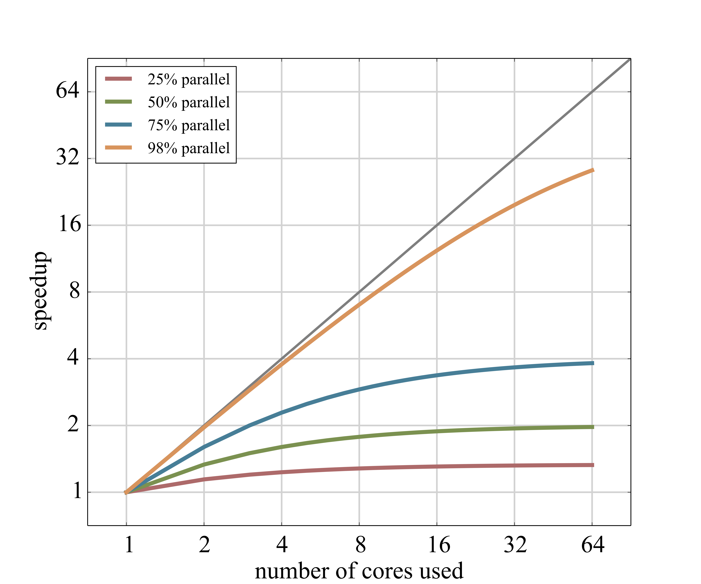
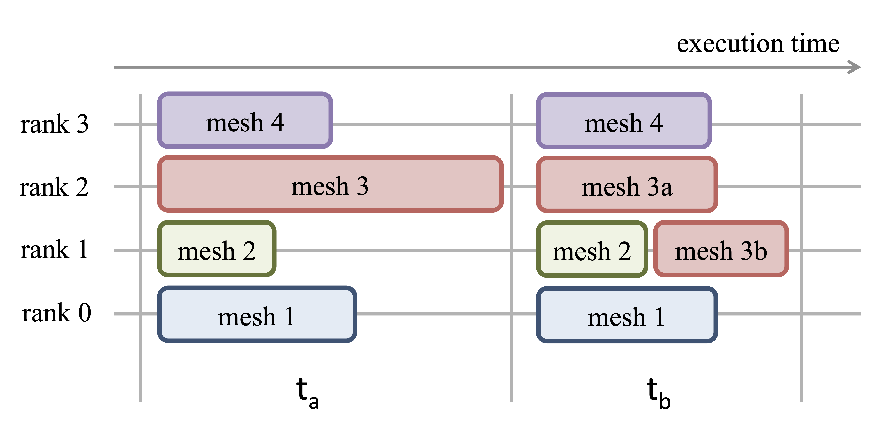
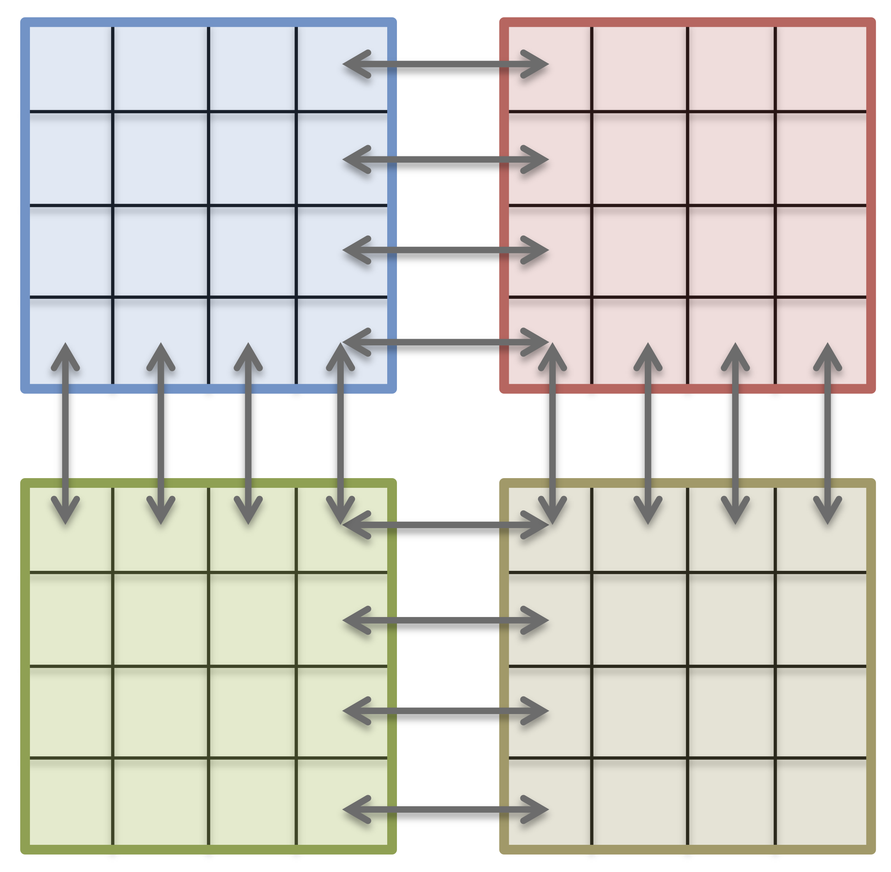
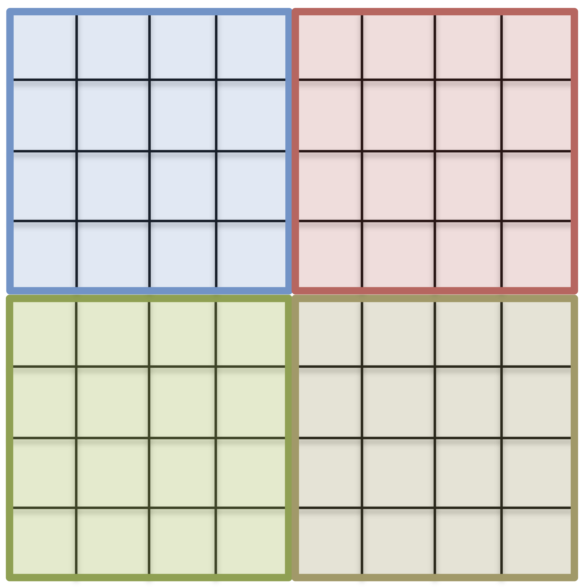
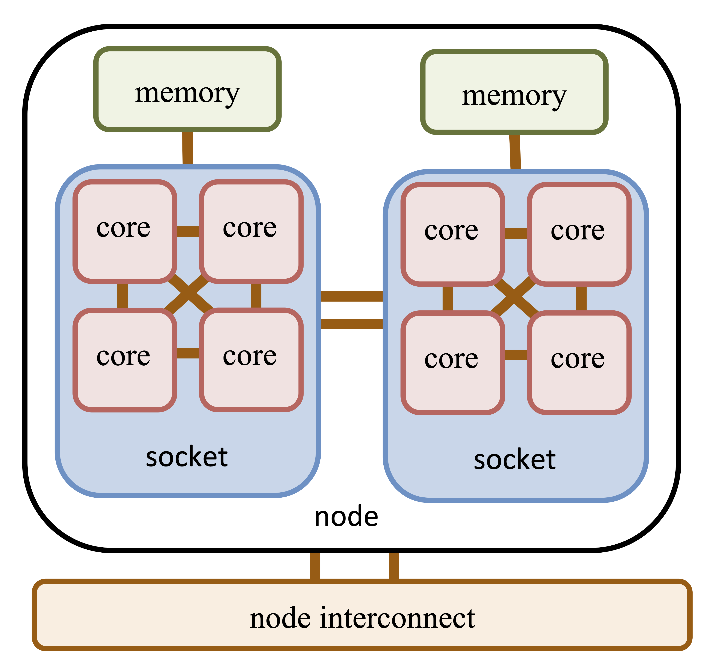

# High Performace Computing

## Overview

Many scientific and engineering problems require a large amount of computing time and memory. This is generally only available on supercomputers / high performance computing (HPC) systems.

Typical applications are:

* science: particle physics, climate research, molecular dynamics
* engineering: CFD, structural mechanics, computer science

HPC with computing power thousands times larger than personal computer allows to significantly reduce the computing time and allows to address new modelling challenges. This is also becoming true for the fire safety science and engineering communities. 

*Example:* An CFD application run for a week on thousand processors would need 20 years on a personal computer (assuming it provides enough memory).

The evolution of computer technology shows one of the fastest development of all technolgies. Considering the nubmer of transistors as a measure for a chip's computing performance, the evolution shows that this number doubles every two years. This observation is called [Moore's law](https://en.wikipedia.org/wiki/Moore%27s_law), see {numref}`fig-hpc-moore`.

:::{figure-md} fig-hpc-moore

The development of the transistor count in the last 5 decades. This observation is represented by Moore's law. Source: [Wikimedia Commons](https://commons.wikimedia.org/wiki/File:Moore%27s_Law_Transistor_Count_1970-2020.png).
:::

## Parallel Execution

### General Principle

An application, is in general a sequence of tasks. Here, a task can be understood as a group of commands or computations that can no further be separated, e.g. due to data dependency.

Yet, there is not necessary a dependency among the tasks. Thus, they can eventually be executed at the same time, see {numref}`fig-hpc-fork`. The process of distributing the tasks on multiple execution units (threads, cores, nodes) is called a fork, while the gathering of the results back to the main execution unit is called a join. During the fork, data and instructions have to be exchanged, thus this introduces an overhead, which is not present in a serial execution. The same is true for the join process, but an additional contribution to the overhead is induced by load balancing issues. Depending on the execution time of individual tasks, especially the longest task, the join process will be prolonged.

:::{figure-md} fig-hpc-fork

Serial and parallel execution of a set of tasks.
:::

### Speedup

The maximal achievable speedup $\mf s$, with respect to a serial execution, on $\mf n$ computing units is limited by the fraction of the execution that runs in parallel $\mf p$. This is reflected by Amdahl's law, see equation {eq}`eq-amdahls-law` and {numref}`fig-hpc-amdahl`. 

$$
s(n, p) = \frac{1}{p+\frac{1}{n}(1-p)} 
$$(eq-amdahls-law)

:::{figure-md} fig-hpc-amdahl

Visualisation for Amdahl's law.
:::

The speedup may even decrease, as some operations become more expensive with increasing number of participating processes, e.g. synchronisation points, global data exchange or broadcasts. 

In cases, where a large number of execution units is involved and the tasks cannot be well decomposed, an unequal workload per process may become the main problem. The execution of one iteration is in general determined by the longest task execution time.

:::{figure-md} fig-hpc-load-balance

Example of load balancing.
:::

### Parallelisation

In general, there is a zoo of possibilities to parallelise an application. In FDS, two of them are utilised:
* [Message Passing Interface (MPI)](https://en.wikipedia.org/wiki/Message_Passing_Interface)
* [Open Multi-Processing (OpenMP or OMP)](https://en.wikipedia.org/wiki/OpenMP)

MPI is a language-independent communication protocol used to develop parallel computerprograms and has its main application  in distributed memory machines. The interface allows to explicitly exchange messages between processes. Therefore it is up to the programmer to design appropriate data structures and algorithms to decompose the application.

In CFD, typically the computational domain is explicitly decomposed and distributed over all MPI processes. For stencil operations only neighbour cells are needed, thus only a domain's halo needs to be shared.

Typically the data exchange (compose, transfer, decompose) produces the most overhead. This overhead is purely due to the explicit problem decomposition.

:::{figure-md} fig-hpc-domain-mpi

Domain decomposition of a simple computational grid, like in FDS. The data communication (arrows) is handled with MPI.
:::

As MPI is only a definition standard, there is more than one implementation of MPI. The most common MPI implementations are:

* Open MPI, open source and free
* MPICH, open source and free
* Intel MPI Library (MPICH derivate), commercial

The MPI implementations include C/C++/FORTRAN header, libraries, compiler wrapper and a runtime environment.

In contrast to MPI, OpenMP (or short OMP) is a standard, to implicitly distribute the execution on a shared memory system.

OMP is implemented as pragmas for C/C++/FORTRAN, and are therefore non intrusive. The typical application is to decompose loops and advise the compiler or the runtime to distribute the loop iterations. The data is not distributed and stays in place, see {numref}`fig-hpc-domain-omp`.

:::{figure-md} fig-hpc-domain-omp

Domain decomposition with OpenMP.
:::

However, the compiler or runtime must detect independent tasks. Loop carried dependencies may prevent parallelisation and data races may produce unpredictable results.

To run an OMP application, there are a few handy environment variables 

* `OMP_NUM_THREADS`, number of OMP threads
* `OMP_STACKSIZE`, the size of the stack for each thread

The execution command is basically equal to the serial execution. A combination with MPI is possible and the OMP environment variables should be passed to the MPI processes. The hybrid approach (MPI+OMP) is used to reduce the number of MPI processes and therefore the overhead of non-scaling operations. Some details and benchmarks of the OMP and MPI+OMP implementation is given in {cite}`Haarhoff.2014`.

## Parallel Computer

### Components

Parallel computers are often called, e.g., supercomputer, high performance computers or compute clusters. The configuration of a common modern parallel computer contains to following elements, see also {numref}`fig-hpc-cluster`.

* **Compute nodes** are the nodes of the communication network. They consist of (multiple) CPUs, accelerators (e.g. GPU), memory and network interfaces.
* **Central Processing Units (CPU)** do the actual computations. Modern CPUs have multiple physical cores, e.g. the AMD EPYC 7452 has 32 cores. Additionally, a node can support multiple processors, each with an own socket.
* **Accelerators** are special hardware, which are capable of solving selected algorithms faster than a CPU. A common representative are Graphics Processing Units (GPU).
* An **Interconnect** enables a fast communication between the nodes. In general, there are multiple networks, e.g. an Ethernet (e.g. 10~Gbit/s) control network and a fast InfiniBand (e.g. 200~Gbit/s) network for data exchange during computation.
* **Parallel file systems** store the computed data on RAID-systems, which are accessable by all nodes.
* **Login nodes** provide a terminal for users to issue computing jobs and data transfer.
* **Batch systems** control the distribution of user issued jobs on the whole system. Typically, users define which resources (e.g. number of node, execution time) are needed for a job and then the job is executed by the batch system, once the required resources become available.

:::{figure-md} fig-hpc-cluster

A very generalistic representation of an element / node of a cluster.
:::

### Performance

One way to express the computing power of a computer system, is to estimate the number of floating point operations (FLOP) per second. This theoretical value represents the peak performance. There exist multiple benchmarks to establish an application oriented value and one of them is a benchmark based on the [LINPACK library](https://en.wikipedia.org/wiki/LINPACK) for linear algebra. Although this benchmark may in many cases not represent the performance of indivudual applications, it is commonly used for a global comparison of computer systems, like in the [TOP500 list](https://www.top500.org).

An interesting representation of the computer evolution is given by the [performance develpment of the TOP500 List](https://www.top500.org/statistics/perfdevel/). It further demonstrates the fast technological development, e.g. a notebook with a theoretical peak performance of about 200~GFLOP/s would head the TOP500 list in 1996 and would be still on the list till 2002.

### JURECA

The system, which is used for this lecture is [JURECA](https://fz-juelich.de/ias/jsc/EN/Expertise/Supercomputers/JURECA/JURECA_node.html) at the Forschungszentrum Jülich.

:::{figure-md} fig-hpc-jureca-dc

JURECA-DC cluster at the Forschungszentrum Jülich. Source: Forschungszentrum Jülich.
:::

### CoBra Cluster

Within the BMBF-funded project CoBra, the CCE chair will setup a computing cluster with a theoretical performance of about 100 TFLOP/s in 2021.

:::{figure-md} fig-hpc-cobra-logo

CoBra project logo – an image of the cluster is yet to be included.
:::
